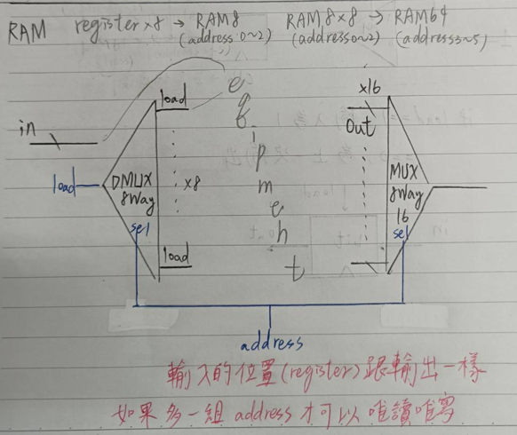
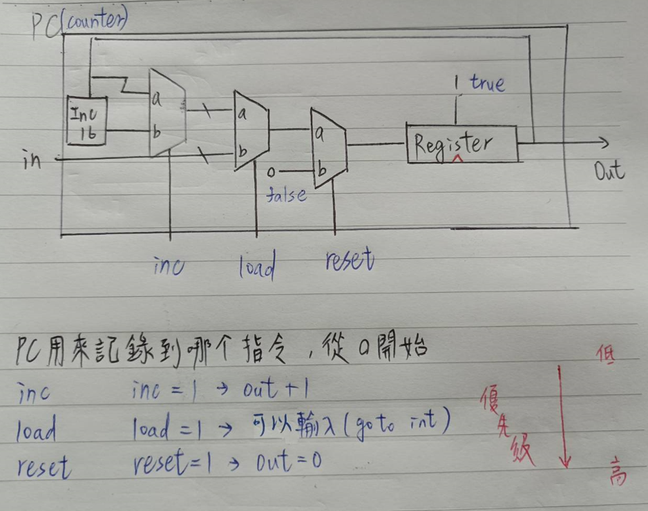

# 製作 || RAM64 || RAM512 || RAM4K || RAM16K || PC ||


> RAM系列用8個組成他的下一個(RAM64*8=RAM512)，原理就是以下這張圖



## 1. RAM64 


```js
// This file is part of www.nand2tetris.org
// and the book "The Elements of Computing Systems"
// by Nisan and Schocken, MIT Press.
// File name: projects/03/a/RAM64.hdl

/**
 * Memory of 64 registers, each 16 bit-wide. Out holds the value
 * stored at the memory location specified by address. If load==1, then 
 * the in value is loaded into the memory location specified by address 
 * (the loaded value will be emitted to out from the next time step onward).
 */

CHIP RAM64 {
    IN in[16], load, address[6];
    OUT out[16];

    PARTS:
    // Put your code here:
    DMux8Way(in = load, sel = address[0..2], a = r1, b = r2, c = r3, d = r4, e = r5, f = r6, g = r7, h = r8);
    RAM8(in = in, load = r1, address = address[3..5], out = ro1); 
    RAM8(in = in, load = r2, address = address[3..5], out = ro2);
    RAM8(in = in, load = r3, address = address[3..5], out = ro3);
    RAM8(in = in, load = r4, address = address[3..5], out = ro4); 
    RAM8(in = in, load = r5, address = address[3..5], out = ro5);
    RAM8(in = in, load = r6, address = address[3..5], out = ro6);
    RAM8(in = in, load = r7, address = address[3..5], out = ro7);
    RAM8(in = in, load = r8, address = address[3..5], out = ro8);
    Mux8Way16(a = ro1, b = ro2, c = ro3, d = ro4, e = ro5, f = ro6, g = ro7, h = ro8, sel = address[0..2], out = out);
}
```

## 2. RAM512


```js
// This file is part of the materials accompanying the book 
// "The Elements of Computing Systems" by Nisan and Schocken, 
// MIT Press. Book site: www.idc.ac.il/tecs
// File name: projects/03/b/RAM512.hdl

/**
 * Memory of 512 registers, each 16 bit-wide. Out holds the value
 * stored at the memory location specified by address. If load==1, then 
 * the in value is loaded into the memory location specified by address 
 * (the loaded value will be emitted to out from the next time step onward).
 */

CHIP RAM512 {
    IN in[16], load, address[9];
    OUT out[16];

    PARTS:
    // Put your code here:
    DMux8Way(in = load, sel = address[0..2], a = r1, b = r2, c = r3, d = r4, e = r5, f = r6, g = r7, h = r8);
    RAM64(in = in, load = r1, address = address[3..8], out = ro1); 
    RAM64(in = in, load = r2, address = address[3..8], out = ro2);
    RAM64(in = in, load = r3, address = address[3..8], out = ro3);
    RAM64(in = in, load = r4, address = address[3..8], out = ro4); 
    RAM64(in = in, load = r5, address = address[3..8], out = ro5);
    RAM64(in = in, load = r6, address = address[3..8], out = ro6);
    RAM64(in = in, load = r7, address = address[3..8], out = ro7);
    RAM64(in = in, load = r8, address = address[3..8], out = ro8);
    Mux8Way16(a = ro1, b = ro2, c = ro3, d = ro4, e = ro5, f = ro6, g = ro7, h = ro8, sel = address[0..2], out = out);
}
```

## 3. RAM4K


```js
// This file is part of www.nand2tetris.org
// and the book "The Elements of Computing Systems"
// by Nisan and Schocken, MIT Press.
// File name: projects/03/b/RAM4K.hdl

/**
 * Memory of 4K registers, each 16 bit-wide. Out holds the value
 * stored at the memory location specified by address. If load==1, then 
 * the in value is loaded into the memory location specified by address 
 * (the loaded value will be emitted to out from the next time step onward).
 */

CHIP RAM4K {
    IN in[16], load, address[12];
    OUT out[16];

    PARTS:
    // Put your code here:
    DMux8Way(in = load, sel = address[0..2], a = r1, b = r2, c = r3, d = r4, e = r5, f = r6, g = r7, h = r8);
    RAM512(in = in, load = r1, address = address[3..11], out = ro1); 
    RAM512(in = in, load = r2, address = address[3..11], out = ro2);
    RAM512(in = in, load = r3, address = address[3..11], out = ro3);
    RAM512(in = in, load = r4, address = address[3..11], out = ro4); 
    RAM512(in = in, load = r5, address = address[3..11], out = ro5);
    RAM512(in = in, load = r6, address = address[3..11], out = ro6);
    RAM512(in = in, load = r7, address = address[3..11], out = ro7);
    RAM512(in = in, load = r8, address = address[3..11], out = ro8);
    Mux8Way16(a = ro1, b = ro2, c = ro3, d = ro4, e = ro5, f = ro6, g = ro7, h = ro8, sel = address[0..2], out = out);
}
```

## 4. RAM16K

```js
// This file is part of www.nand2tetris.org
// and the book "The Elements of Computing Systems"
// by Nisan and Schocken, MIT Press.
// File name: projects/03/b/RAM16K.hdl

/**
 * Memory of 16K registers, each 16 bit-wide. Out holds the value
 * stored at the memory location specified by address. If load==1, then 
 * the in value is loaded into the memory location specified by address 
 * (the loaded value will be emitted to out from the next time step onward).
 */

CHIP RAM16K {
    IN in[16], load, address[14];
    OUT out[16];

    PARTS:
    // Put your code here:
    DMux4Way(in = load, sel = address[0..1], a = r1, b = r2, c = r3, d = r4);
    RAM4K(in = in, load = r1, address = address[2..13], out = ro1); 
    RAM4K(in = in, load = r2, address = address[2..13], out = ro2);
    RAM4K(in = in, load = r3, address = address[2..13], out = ro3);
    RAM4K(in = in, load = r4, address = address[2..13], out = ro4); 
    Mux4Way16(a = ro1, b = ro2, c = ro3, d = ro4,  sel = address[0..1], out = out);
}
```

## 5. PC




```js
// This file is part of www.nand2tetris.org
// and the book "The Elements of Computing Systems"
// by Nisan and Schocken, MIT Press.
// File name: projects/03/a/PC.hdl

/**
 * A 16-bit counter with load and reset control bits.
 * if      (reset[t] == 1) out[t+1] = 0
 * else if (load[t] == 1)  out[t+1] = in[t]
 * else if (inc[t] == 1)   out[t+1] = out[t] + 1  (integer addition)
 * else                    out[t+1] = out[t]
 */

CHIP PC {
    IN in[16],load,inc,reset;
    OUT out[16];

    PARTS:
    // Put your code here:
    // inc
    Inc16(in = OB, out = OBA1);
    Mux16(a = OB, b = OBA1, sel = inc, out = OBI);
    // load
    Mux16(a = OBI, b = in, sel = load, out = OBIL);
    // reset
    Mux16(a = OBIL, b = false, sel = reset, out = OBILR);
    // register
    Register(in = OBILR, load = true, out = OB,out = out);
}
```