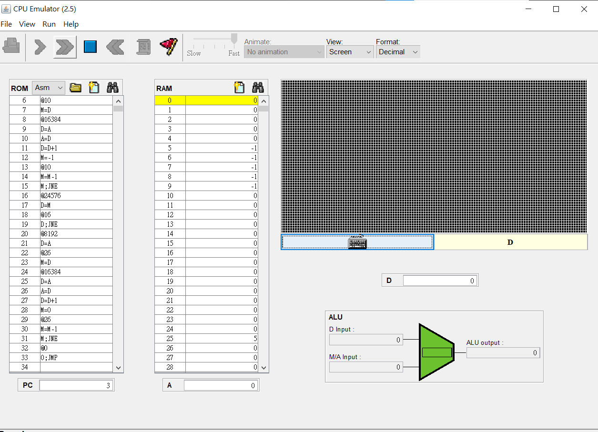
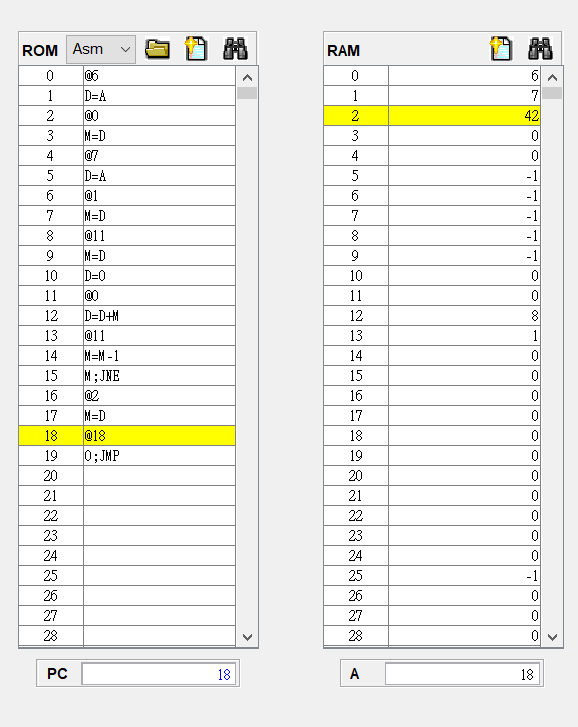
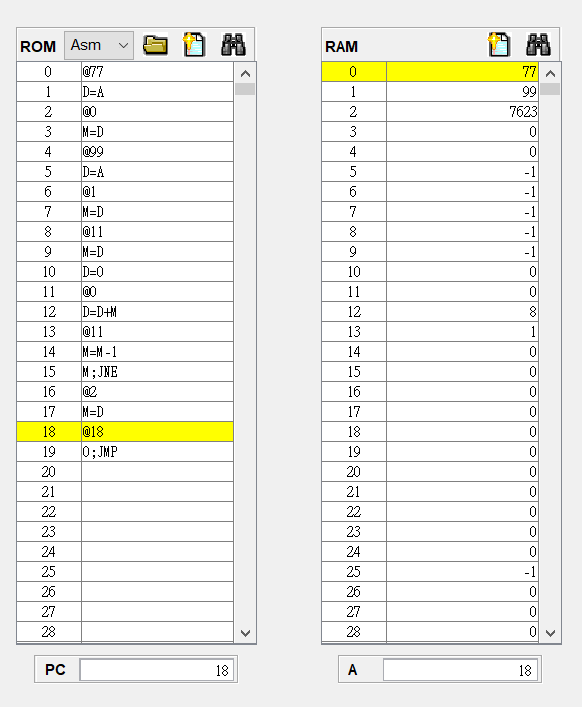

# 組合語言




## fill

```js
// This file is part of www.nand2tetris.org
// and the book "The Elements of Computing Systems"
// by Nisan and Schocken, MIT Press.
// File name: projects/04/Fill.asm

// Runs an infinite loop that listens to the keyboard input.
// When a key is pressed (any key), the program blackens the screen,
// i.e. writes "black" in every pixel;
// the screen should remain fully black as long as the key is pressed. 
// When no key is pressed, the program clears the screen, i.e. writes
// "white" in every pixel;
// the screen should remain fully clear as long as no key is pressed.

// Put your code here.

// 偵測鍵盤位置有沒有輸入
0.  @24576  // keyboard
1.  D=M     // 把memory 24576的值取出
2.  @0
3.  D;JEQ   // 如果值為0就返回第一個

// 使用變數判斷迴圈到甚麼時候停
4.  @8192  // 24576-16384 = 8192(把所有螢幕做調整，值會慢慢減，減到0跳出迴圈)
5.  D=A    // 把值(8192)給 D
6.  @10    // 把值放到 M 10裡面(@10是跳回的地方(A=D)，順便做判斷)
7.  M=D

// 螢幕變白，開始迴圈
8.  @16384
9.  D=A    // 把值(16384)給 D
10. A=D    // 把值回傳給A (@D)
11. D=D+1  // 值會一直增加，所以迴圈時，位置也會一直上升
12. M=-1   // 把 M A 位置的值變 -1(黑色)

13. @10    
14. M=M-1  // M 10 遞減
15. M;JNE  // 如果 M == 0 就跳出迴圈，else 跳回10的地方做迴圈

// 螢幕變黑後，偵測keyboard是否放開(0)
16. @24576 
17. D=M    // 24576-16384 = 8192(把所有螢幕做調整，值會慢慢減，減到0跳出迴圈)
18. @16    // 把值(8192)給 D
19. D;JNE  // 如果 D == 0 就跳出迴圈，else 跳回16的地方做迴圈

// 使用變數判斷迴圈到甚麼時候停，這之後都跟上面(4. ~ 15.)的差不多
20. @8192  // 把數字存到M裡面
21. D=A    // 把值(16384)給 D
22. @26    // 把值放到 M 26裡面(@26是跳回的地方(A=D)，順便做判斷)
23. M=D

// 螢幕變白，
24. @16384 // 把值(16384)給 D
25. D=A    // 把值回傳給A (@D)
26. A=D    // 把值回傳給A (@D)
27. D=D+1  // 值會一直增加，所以迴圈時，位置也會一直上升
28. M=0   // 把 M A 位置的值變 0(白色)

29. @26
30. M=M-1  // M 10 遞減
31. M;JNE  // 如果 M == 0 就跳出迴圈，else 跳回25的地方做迴圈

// 結束一套，跳回原點
32. @0
33. 0;JMP
```





## mult

```js
// This file is part of www.nand2tetris.org
// and the book "The Elements of Computing Systems"
// by Nisan and Schocken, MIT Press.
// File name: projects/04/Mult.asm

// Multiplies R0 and R1 and stores the result in R2.
// (R0, R1, R2 refer to RAM[0], RAM[1], and RAM[2], respectively.)

// Put your code here.

// 填入第一個值
0.   @2     // 第一個值
1.   D=A    // 值放入D
2.   @0     
3.   M=D    // 把 D 填入 M 0

4.   @4     // 第二個值
5.   D=A    // 值放入D
6.   @1
7.   M=D    // 把 D 填入 M 1
8.   @11    // 把值放到 M 12裡面(@12是跳回的地方(D=D+M)，順便做判斷)
9.   M=D    // 這個當作過渡變數，遞減判斷迴圈

10.  D=0
11.  @0    
12.  D=D+M  // 把數字相加多次變成乘
13.  @11
14.  M=M-1  // 判定加的次數(第二個值)
15.  M;JNE  // 如果 M == 0 跳出迴圈

16.  @2     // 第三個數
17.  M=D    // 把最後相乘的數放到 M 2

// 卡迴圈
18.  @18
19.  0;JMP

```