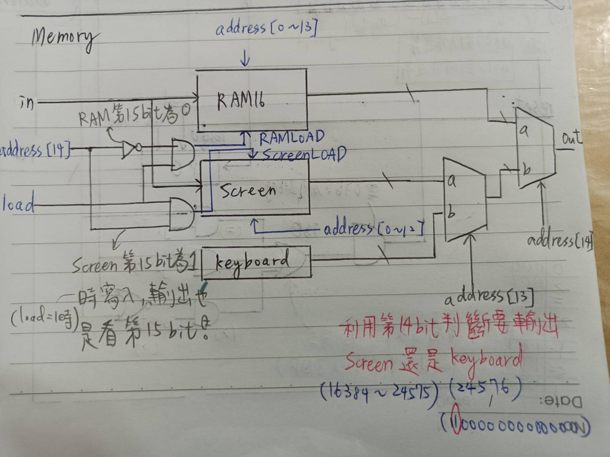
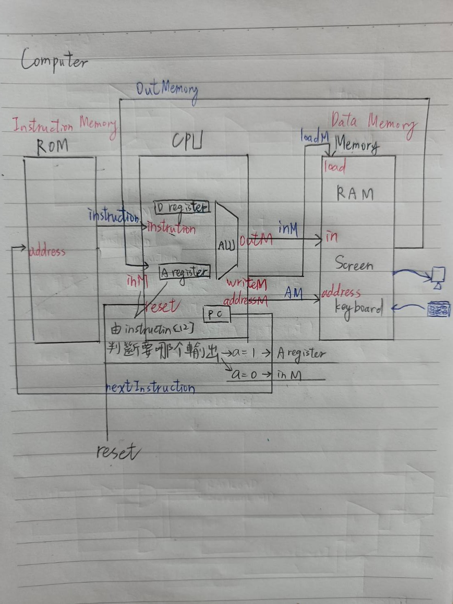

# 製作 || Memory || Computer 


## 1. Memory


```js
// This file is part of www.nand2tetris.org
// and the book "The Elements of Computing Systems"
// by Nisan and Schocken, MIT Press.
// File name: projects/05/Memory.hdl

/**
 * The complete address space of the Hack computer's memory,
 * including RAM and memory-mapped I/O. 
 * The chip facilitates read and write operations, as follows:
 *     Read:  out(t) = Memory[address(t)](t)
 *     Write: if load(t-1) then Memory[address(t-1)](t) = in(t-1)
 * In words: the chip always outputs the value stored at the memory 
 * location specified by address. If load==1, the in value is loaded 
 * into the memory location specified by address. This value becomes 
 * available through the out output from the next time step onward.
 * Address space rules:
 * Only the upper 16K+8K+1 words of the Memory chip are used. 
 * Access to address>0x6000 is invalid. Access to any address in 
 * the range 0x4000-0x5FFF results in accessing the screen memory 
 * map. Access to address 0x6000 results in accessing the keyboard 
 * memory map. The behavior in these addresses is described in the 
 * Screen and Keyboard chip specifications given in the book.
 */

CHIP Memory {
    IN in[16], load, address[15];
    OUT out[16];

    PARTS:
    // Put your code here:

    // 2的14次方(16384)以下都歸RAM管理(0~13 bit)，第15個位元 == 0，所以用Not判定是不是要使用RAM
    Not(in = address[14], out = RAM16);

    // screen管理 2**14(16384) ~ 2**15(24575)，第15個位元 == 1
    And(a = address[14], b = load, out = screenLOAD);

    And(a = RAM16, b = load, out = RAMLOAD);

    RAM16K(in = in, address = address[0..13], load = RAMLOAD, out = R);
    Screen(in = in, address = address[0..12], load = screenLOAD, out = S);

    // 讀取24576(110000000000000)可以知道按鍵位置(ASCLL)
    Keyboard(out = kout);

    // 第14位元判斷是鍵盤輸出還是螢幕輸出
    Mux16(a = S, b = kout, sel = address[13], out = if1);
    // 第15位元判斷要輸出S還是R還是K
    Mux16(a = R, b = if1, sel = address[14], out = out);
}
```

## 2. Computer 


```js
// This file is part of www.nand2tetris.org
// and the book "The Elements of Computing Systems"
// by Nisan and Schocken, MIT Press.
// File name: projects/05/Computer.hdl

/**
 * The HACK computer, including CPU, ROM and RAM.
 * When reset is 0, the program stored in the computer's ROM executes.
 * When reset is 1, the execution of the program restarts. 
 * Thus, to start a program's execution, reset must be pushed "up" (1)
 * and "down" (0). From this point onward the user is at the mercy of 
 * the software. In particular, depending on the program's code, the 
 * screen may show some output and the user may be able to interact 
 * with the computer via the keyboard.
 */


CHIP Computer {
    IN reset;
    
    PARTS:
    
    // 從CPU讀取輸入(inM)  // 可以使用keyboard控制memorys
    Memory(in=inM, load=loadM, address=AM, out=outMemory);

    // inM 讀取 Memory的資料，writeM控制memory是否寫入(instruction[15], instruction[3])
    // CPU輸出(OutM)到memory裡面，然後再
    CPU(inM=outMemory, instruction=instruction, reset=reset, outM=inM, writeM=loadM, addressM=AM, pc=nextInstruction);

    // 使用nand2tetris內建ROM，接收收到的指令(nextInstruction，從CPU的CP輸入)
    ROM32K(address=nextInstruction, out=instruction);
}
```

> Computer測試

```js
// ComputerAdd
| time |reset|ARegister|DRegister|PC[]|RAM16K[0]|RAM16K[1]|RAM16K[2]|
| 0    |  0  |       0 |       0 |   0|       0 |       0 |       0 |
| 1    |  0  |       2 |       0 |   1|       0 |       0 |       0 |
| 2    |  0  |       2 |       2 |   2|       0 |       0 |       0 |
| 3    |  0  |       3 |       2 |   3|       0 |       0 |       0 |
| 4    |  0  |       3 |       5 |   4|       0 |       0 |       0 |
| 5    |  0  |       0 |       5 |   5|       0 |       0 |       0 |
| 6    |  0  |       0 |       5 |   6|       5 |       0 |       0 |
| 7    |  1  |       0 |       5 |   0|       0 |       0 |       0 |
| 8    |  0  |       2 |       5 |   1|       0 |       0 |       0 |
| 9    |  0  |       2 |       2 |   2|       0 |       0 |       0 |
| 10   |  0  |       3 |       2 |   3|       0 |       0 |       0 |
| 11   |  0  |       3 |       5 |   4|       0 |       0 |       0 |
| 12   |  0  |       0 |       5 |   5|       0 |       0 |       0 |
| 13   |  0  |       0 |       5 |   6|       5 |       0 |       0 |


//ComputerMax
| time |reset|ARegister|DRegister|PC[]|RAM16K[0]|RAM16K[1]|RAM16K[2]|
| 0    |  0  |       0 |       0 |   0|       3 |       5 |       0 |
| 1    |  0  |       0 |       0 |   1|       3 |       5 |       0 |
| 2    |  0  |       0 |       3 |   2|       3 |       5 |       0 |
| 3    |  0  |       1 |       3 |   3|       3 |       5 |       0 |
| 4    |  0  |       1 |      -2 |   4|       3 |       5 |       0 |
| 5    |  0  |      10 |      -2 |   5|       3 |       5 |       0 |
| 6    |  0  |      10 |      -2 |   6|       3 |       5 |       0 |
| 7    |  0  |       1 |      -2 |   7|       3 |       5 |       0 |
| 8    |  0  |       1 |       5 |   8|       3 |       5 |       0 |
| 9    |  0  |      12 |       5 |   9|       3 |       5 |       0 |
| 10   |  0  |      12 |       5 |  12|       3 |       5 |       0 |
| 11   |  0  |       2 |       5 |  13|       3 |       5 |       0 |
| 12   |  0  |       2 |       5 |  14|       3 |       5 |       5 |
| 13   |  0  |      14 |       5 |  15|       3 |       5 |       5 |
| 14   |  0  |      14 |       5 |  14|       3 |       5 |       5 |
| 15   |  1  |      14 |       5 |   0|       3 |       5 |       5 |
| 15   |  0  |      14 |       5 |   0|   23456 |   12345 |       5 |
| 16   |  0  |       0 |       5 |   1|   23456 |   12345 |       5 |
| 17   |  0  |       0 |   23456 |   2|   23456 |   12345 |       5 |
| 18   |  0  |       1 |   23456 |   3|   23456 |   12345 |       5 |
| 19   |  0  |       1 |   11111 |   4|   23456 |   12345 |       5 |
| 20   |  0  |      10 |   11111 |   5|   23456 |   12345 |       5 |
| 21   |  0  |      10 |   11111 |  10|   23456 |   12345 |       5 |
| 22   |  0  |       0 |   11111 |  11|   23456 |   12345 |       5 |
| 23   |  0  |       0 |   23456 |  12|   23456 |   12345 |       5 |
| 24   |  0  |       2 |   23456 |  13|   23456 |   12345 |       5 |
| 25   |  0  |       2 |   23456 |  14|   23456 |   12345 |   23456 |


//ComputerRect
| time |ARegister|DRegister|PC[]|RAM16K[0]|RAM16K[1]|RAM16K[2]|
| 0    |       0 |       0 |   0|       4 |       0 |       0 |
| 1    |       0 |       0 |   1|       4 |       0 |       0 |
| 2    |       0 |       4 |   2|       4 |       0 |       0 |
| 3    |      23 |       4 |   3|       4 |       0 |       0 |
| 4    |      23 |       4 |   4|       4 |       0 |       0 |
| 5    |      16 |       4 |   5|       4 |       0 |       0 |
| 6    |      16 |       4 |   6|       4 |       0 |       0 |
| 7    |   16384 |       4 |   7|       4 |       0 |       0 |
| 8    |   16384 |   16384 |   8|       4 |       0 |       0 |
| 9    |      17 |   16384 |   9|       4 |       0 |       0 |
| 10   |      17 |   16384 |  10|       4 |       0 |       0 |
| 11   |      17 |   16384 |  11|       4 |       0 |       0 |
| 12   |   16384 |   16384 |  12|       4 |       0 |       0 |
| 13   |   16384 |   16384 |  13|       4 |       0 |       0 |
| 14   |      17 |   16384 |  14|       4 |       0 |       0 |
| 15   |      17 |   16384 |  15|       4 |       0 |       0 |
| 16   |      32 |   16384 |  16|       4 |       0 |       0 |
| 17   |      32 |   16416 |  17|       4 |       0 |       0 |
| 18   |      17 |   16416 |  18|       4 |       0 |       0 |
| 19   |      17 |   16416 |  19|       4 |       0 |       0 |
| 20   |      16 |   16416 |  20|       4 |       0 |       0 |
| 21   |      16 |       3 |  21|       4 |       0 |       0 |
| 22   |      10 |       3 |  22|       4 |       0 |       0 |
| 23   |      10 |       3 |  10|       4 |       0 |       0 |
| 24   |      17 |       3 |  11|       4 |       0 |       0 |
| 25   |   16416 |       3 |  12|       4 |       0 |       0 |
| 26   |   16416 |       3 |  13|       4 |       0 |       0 |
| 27   |      17 |       3 |  14|       4 |       0 |       0 |
| 28   |      17 |   16416 |  15|       4 |       0 |       0 |
| 29   |      32 |   16416 |  16|       4 |       0 |       0 |
| 30   |      32 |   16448 |  17|       4 |       0 |       0 |
| 31   |      17 |   16448 |  18|       4 |       0 |       0 |
| 32   |      17 |   16448 |  19|       4 |       0 |       0 |
| 33   |      16 |   16448 |  20|       4 |       0 |       0 |
| 34   |      16 |       2 |  21|       4 |       0 |       0 |
| 35   |      10 |       2 |  22|       4 |       0 |       0 |
| 36   |      10 |       2 |  10|       4 |       0 |       0 |
| 37   |      17 |       2 |  11|       4 |       0 |       0 |
| 38   |   16448 |       2 |  12|       4 |       0 |       0 |
| 39   |   16448 |       2 |  13|       4 |       0 |       0 |
| 40   |      17 |       2 |  14|       4 |       0 |       0 |
| 41   |      17 |   16448 |  15|       4 |       0 |       0 |
| 42   |      32 |   16448 |  16|       4 |       0 |       0 |
| 43   |      32 |   16480 |  17|       4 |       0 |       0 |
| 44   |      17 |   16480 |  18|       4 |       0 |       0 |
| 45   |      17 |   16480 |  19|       4 |       0 |       0 |
| 46   |      16 |   16480 |  20|       4 |       0 |       0 |
| 47   |      16 |       1 |  21|       4 |       0 |       0 |
| 48   |      10 |       1 |  22|       4 |       0 |       0 |
| 49   |      10 |       1 |  10|       4 |       0 |       0 |
| 50   |      17 |       1 |  11|       4 |       0 |       0 |
| 51   |   16480 |       1 |  12|       4 |       0 |       0 |
| 52   |   16480 |       1 |  13|       4 |       0 |       0 |
| 53   |      17 |       1 |  14|       4 |       0 |       0 |
| 54   |      17 |   16480 |  15|       4 |       0 |       0 |
| 55   |      32 |   16480 |  16|       4 |       0 |       0 |
| 56   |      32 |   16512 |  17|       4 |       0 |       0 |
| 57   |      17 |   16512 |  18|       4 |       0 |       0 |
| 58   |      17 |   16512 |  19|       4 |       0 |       0 |
| 59   |      16 |   16512 |  20|       4 |       0 |       0 |
| 60   |      16 |       0 |  21|       4 |       0 |       0 |
| 61   |      10 |       0 |  22|       4 |       0 |       0 |
| 62   |      10 |       0 |  23|       4 |       0 |       0 |
| 63   |      23 |       0 |  24|       4 |       0 |       0 |
```
